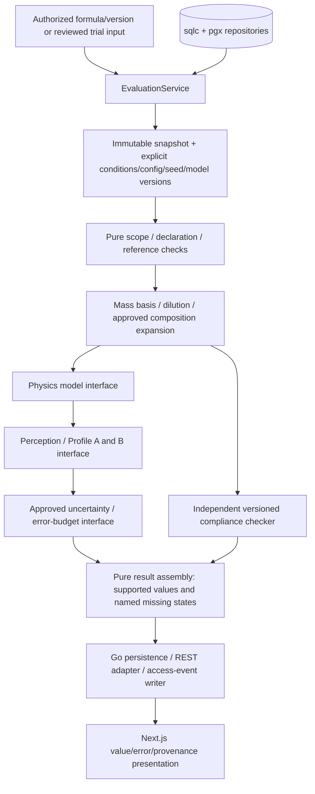

<!-- AI Perfumery Engine project documentation; ownership follows the owner's existing agreement. No new licence is granted. -->
# Calculation Engine — MVP Analysis and Laboratory Evidence

**Updated:** 2026-10-04. The owner's revision adopts source frontend MVP waves 0–5, while retaining Go + Gin, PostgreSQL and sqlc + pgx. [mvp-scope.md](mvp-scope.md) supersedes the earlier four-output/view-only scope; [tech-stack.md](tech-stack.md), [data-model.md](data-model.md), [roles-permissions.md](roles-permissions.md) and [api-contract.md](api-contract.md) are the companion designs. No engine implementation, approved numerical model or validated predictions are created by this revision.

Source: Honney's existing pure-engine/result design and dataset structure; frontend commit `aa572abaede14c11796a1551434858171eb37363`, `api/openapi.yaml`, R1/R2/J15/X3 wireframes and handoff. Source UI expectations are adopted; toy equations, fixture values, uncertainty tiers/defaults and upstream pending decisions are not evidence of validated chemistry. `rule.md` remains authoritative.

## 1. Outputs and current evidence

| Output family | Local requirement | Design/readiness |
|---|---|---|
| Exact declared percentages, totals and batch targets | FR-004, FR-011, FR-012 | Server validation/arithmetic over reviewed decimal inputs; exact formula sum, no normalization |
| Category/version/jurisdiction-aware findings and sourced blocks | FR-005, FR-014 | Independent compliance block; source rule semantics/coverage still need expert/legal review |
| Odour/profile and time evolution, including Profile A/B | FR-009, FR-010, CER-005 | Interfaces only until model/profile definitions, conditions and source inputs are approved. The composition share weighting is the one exception and ships now; see §6 |
| Real analysis-step state, seed and separate input/model changes | FR-006, CER-004 | Orchestration records actual progress/evidence; no pretend successful stages |
| Quantified uncertainty, error budget and complete provenance | CER-001, CER-004, CER-005 | Report only supported intervals/tiers/sensitivities; otherwise a named missing state |
| Laboratory mass/volume/drop bridge and weighing verdict | FR-012, FR-013 | Requires instrument/calibration/density evidence and approved uncertainty/tolerance policy |
| Material-group/pair checks | FR-003, FR-005, CER-002 | Supplied dataset lacks authoritative group/pair rules; `insufficient data` |

The frontend describes physical/perceptual modules and a result assembly sequence, not equations ready for Go implementation. A route or schema field for longevity/projection/sillage does not prove those quantities can currently be computed. Missing outputs must be visible rather than filled with demonstration predictions.

## 2. Internal `Result[T]` and REST values

Retain Honney's internal result envelope for every pure calculator:

| Field | Contract |
|---|---|
| `Status` | `ok` or `insufficient_data` |
| `Value` | Present only when the relevant value can be produced |
| `Citations` | Exact input/source/rule/model/version references; never empty for a produced result |
| `Missing` | Absent input/model/policy and safe reason; may link to provenance |

The snapshot/results additionally carry approved unit/conditions/method/uncertainty/tier/error-budget evidence when required. These may be typed metadata attached to `T`; adding metadata does not relax the no-guesses result contract.

The Go API adapter distinguishes three presentation types from the source contract:

| REST type | Use | Mandatory evidence |
|---|---|---|
| `Quantity` | Exact/declared input or deterministic exact arithmetic on declared quantities | Unit and server `display_decimals`; trace to declaration/arithmetic source |
| `ReportedValue` | Measurement or estimated real-world value | Supported interval/coverage level, approved tier, unit, display precision and provenance reference |
| `MissingValue` | Cannot report a supported estimate | `unquantified`, `not_measured`, `no_data`, `out_of_scope` or `needs_calibration`, reason and optional evidence link |

Never convert a computed estimate to `Quantity` to avoid uncertainty. A measured mass is not exact simply because its decimal text is precise. An unsupported interval/tier cannot be synthesized to satisfy a schema: return `MissingValue` and name the missing policy/data. The source's T1–T6/confidence/applicability fields describe a proposed reporting policy; assigning them requires approved definitions and evidence. Missing is never zero, an invisible omission, pass or a generic error.

User-entered decimals remain strings through request validation, exact persistence and server numeric handling, preserving typed scale. The browser may format according to server display precision but cannot round business values, recompute totals/intervals/conversions/verdicts or draw an estimate without its required band. Large/exact numeric JSON serialization and Go decimal representation need a reviewed precision policy; no package is silently selected here.

## 3. Pure engine versus orchestration

| Part | Responsibility | I/O |
|---|---|---|
| Go REST handlers/auth/permissions | Validate session/MFA/CSRF, action and record/tenant scope, stable errors | Server state/clock/logging |
| `EvaluationService` | Load a tenant-authorized immutable formula/reference/rule snapshot; apply transient overrides; select explicit approved config/seed/model versions; manage runs/cache/progress | sqlc + pgx/repositories and access-event writer |
| Pure Go engine | Compute supported results only from the supplied snapshot/config/seed | No database, network, files or wall-clock |
| API/result persistence adapter | Store run/results/provenance and adapt result envelopes to REST values | Server persistence, outside engine |
| Next.js | Render the contract, submit explicit input, show progress/results/errors | REST only; no official calculation |

Same snapshot, explicit seed, configuration and model versions must reproduce the same output. Any clock-dependent choice is resolved before calling the engine and included in input; a random seed never originates implicitly inside a calculator. No external LLM/model service is needed for core formulation/calculation (CER-003, NFR-004).

FR-007 overlays trial input in memory and runs the same engine. This creates no saved formula version. Saving is a separate explicit version-creation command, with authorization/validation/concurrency checks. Required calculation access events and optional run evidence persist outside the engine. The source analyze route accepts a saved formula/version, so the transient override request schema remains a gate in [api-contract.md](api-contract.md); do not claim that route already supports what-if.

## 4. Dataflow and independent branches



Scope accepts only the adopted MVP vehicle class (`hydroalcoholic`) and requires explicit application conditions. Unsupported vehicles stop before model execution with a named scope reason. The scope gate does not imply an approved physical model for every in-scope vehicle.

Within scope, missing/unquantified physics or perception does not stop an independent compliance check that has its own required evidence. Missing regulatory data likewise does not invalidate a supported physical result. Show each branch's actual status; no global all-compliant conclusion and no assembly step guessing a failed substep's value. The exact substeps correspond to models actually available, not fictitious progress copied from a mock.

## 5. Formula validation, quantities and provenance

Formula editing is w/w. The server sums exact declared decimal percentages and requires exactly 100% for a saved/analyzed formula. It returns the official total/difference when invalid; neither Next.js nor Go normalizes secretly. Reference/grade ambiguity is flagged. Nested formulas pin immutable versions and need approved expansion/recursion rules before execution.

The established mass/dilution relationship remains:

```text
pct_in_formula = item_mass / sum_item_mass * 100
pct_in_product = pct_in_formula * concentrate_in_product_pct / 100
```

For percentage-declared input, `pct_in_formula` is the validated declaration rather than an unnecessary normalization. Do not reinterpret product dilution/concentration class as a hidden default percentage. Apply finished-product dilution exactly once, show both bases, and account for approved SKU/carrier/pre-dilution expansion. Missing dilution/category leaves dependent compliance values missing; independent declared formula shares remain visible. Density absent from the supplied data blocks a volume-to-mass conversion rather than licensing an assumption.

**Quantity unit: grams. Team decision, 2026-10-04; confirmed by the owner, 2026-10-06.** Checked against the supplied 10-substance sample: 34 columns, no density under any name. Mass quantities are therefore stored and declared in grams, and the unit field accepts no other value until sourced density observations exist. A millilitre quantity returns `MissingValue` naming the absent density rather than being converted. Supplier specification sheets do carry a relative density, but as a per-supplier specification range rather than a measurement of the material in hand, so it cannot back a `Quantity`; obtaining density remains the domain decision recorded in §9.

Every result links to its actual immutable input/source/model/rule versions and conditions. Error-budget contributors link through all provenance nodes to observations/documents/locators; MVP simplifies graph drawing to a navigable list/tree only. It does not delete nodes, collapse different predictions into a generic graph or hide unsupported assumptions. Missing-value reasons have their own explanation path. No unapproved proxy/substitution is introduced automatically.

## 6. Physics, profile and uncertainty gates

`PhysicsModel`, `PerceptionModel`, `OdourWeighting` and `UncertaintyPolicy` remain replaceable pure interfaces until approved definitions exist. Each must expose equation/version/conditions/applicability/assumptions/citations and its missing-data behavior. Profile A/B meanings, reported endpoints, odour-family weighting and any numeric mapping from categorical strength need domain decisions; mass share is not silently presented as perceptual strength.

Volatility observations retain Antoine form/log base, pressure/temperature units and validity range. Do not mix coefficient forms or extrapolate outside the valid domain without an explicitly approved marked-extrapolation policy; otherwise return missing/out-of-scope. Surface area, airflow and other application assumptions are explicit reviewed inputs, never silent defaults. Reference tables do not establish a validated mixture/perception equation.

Seed/version/snapshot are shown with results. Formula-input change and model-version change remain separate indicators. Cache reuse requires identical immutable input/data/rule snapshots, explicit conditions/config/seed/model versions and authorized tenant context; stale results are marked/refused rather than reused under a formula-id-only key.

Uncertainty propagation/coverage, sampling method, sensitivity shares, tier/confidence/applicability policy and error-budget reducibility are `insufficient information` until expert evidence is supplied. Do not import Monte Carlo/GUM/Morris/Sobol implementations merely because wireframe labels mention them. A point estimate without approved reporting uncertainty cannot masquerade as a validated evolution curve; render its missing state.

### 6.1 Odour weighting is selected per request, never substituted

Team decision, 2026-10-04; option set and default set by the owner's answers, 2026-10-06. `OdourWeighting` carries two registered implementations. The caller names which one it wants, so a later domain answer changes a default instead of changing code.

| id | What a bar height means | Needs | State |
|---|---|---|---|
| `odour_units` | Perceived strength as an odour activity value (OAV): amount divided by detection threshold, so a trace material with a very low threshold reads as large | `material_odor_properties` detection threshold | **Default** (owner, 2026-10-06). The owner confirms the full dataset carries thresholds; a material without one returns `MissingValue` |
| `mass` | Share of the concentrate by weight. A declared composition figure, presented as composition and never labelled as perceived strength | Declared item masses, always present | Always available; exact arithmetic on declared quantities, so it is a `Quantity`, not an estimate |

**Removed 2026-10-06: categorical strength.** TGSC's low/medium/high odour strength is the source's own editorial label; TGSC does not publish how it assigns it, and no standard maps it to numbers, so any mapping would be invented. The owner asked for a principled basis, and OAV is the measure the flavour and fragrance literature uses for a compound's contribution to a mixture. The category stays stored as source text and is not used for weighting. OAV is linear in concentration while perceived intensity is not (Stevens' power law); it is the accepted first approximation, stated as such on the chart.

Three rules hold for both:

- **The engine never switches weighting on its own.** It serves exactly the one requested, and one whose inputs are absent returns `MissingValue` naming them. The toggle belongs to the user interface. Two charts drawn with different arithmetic must never look alike.
- **The response reports per-weighting availability**, so the interface can present an option as unusable for this formula instead of drawing an empty chart.
- **Partial families are marked, not hidden.** A material that has an odour type but lacks the chosen weighting's input is listed under its family and excluded from the height; a material with no odour type is not placed in a family at all and is reported as `insufficient data`. Each bar carries how many of its family's materials the height was built from, beside the number rather than in a footnote. A short bar reading as a weak family when it means absent data is the failure this prevents.

**Coverage in the supplied sample, measured 2026-10-04**, structure only, no values: the TGSC detection threshold column is empty in 10 of 10 substances and the secondary threshold column holds 2 of 10, so `odour_units` cannot be computed from the current sample at all. EU CosIng status is present in 6 of 10, so four substances legitimately return a missing regulatory state. The owner confirmed on 2026-10-06 that the full set carries detection thresholds. Two checks remain for import: how many of the 100 substances actually have one, and in which medium and unit (air and water thresholds cannot be mixed in one chart).

### 6.2 Chart adjustability

Both charts adjust in place without a page reload (NFR-002). They do not adjust the same way, and only some adjustments reach the server.

| Chart | Adjustment | Runs where |
|---|---|---|
| Evolution/evaporation (FR-010) | Time range and resolution | Server. Curves are computed per request from the snapshot, and the response replaces the series |
| Evolution/evaporation (FR-010) | Model: each alone, Raoult mixture, tenacity (§6.3) | Server, because every curve is recomputed |
| Odour profile (FR-009) | Value axis, linear or logarithmic | Client |
| Odour profile (FR-009) | How many families before the long tail collapses into one group | Client |
| Odour profile (FR-009) | Weighting toggle | Server, because every bar height is recomputed |

The client-side adjustments require no new request when the response carries each material's contribution. A logarithmic option is not cosmetic for `odour_units`: detection thresholds span orders of magnitude, so on a linear axis every bar but the largest disappears. The browser still may not recompute a business value, only re-present one (§2).

### 6.3 Evaporation model is selected per request, conditions are fixed

Team decision, 2026-10-05. `PhysicsModel` carries three registered options, chosen by a toggle above the evolution chart, the same way §6.1 handles weighting. The owner chose `raoult` as the default on 2026-10-06; the other two stay selectable.

| id | What it computes | Inputs from the dataset |
|---|---|---|
| `independent` | Each material evaporates as a pure film: flux = k × Psat / (R × T) | `Psat_25C_Pa` |
| `raoult` | Ideal mixture: Psat scaled by the material's mole fraction, stepped through time because fractions change as materials leave | `Psat_25C_Pa`, `MW (g/mol)` |
| `tenacity` | No equation. One bar per material for its measured "smellable for" hours | `TGSC Tenacity (hours)` |

- **Conditions are one fixed, stated reference**: paper blotter, still air (k = 1e-4 m/s), 25 °C, 1 mg/cm². It sets the time scale and is shown beside every curve. Skin temperature, spray area and airflow are not modelled; the team judged them too complex for this project. This replaces the temperature/conditions row of §6.2.
- Non-ideal mixtures (activity coefficients) are out of scope.
- `odour_units` over time divides the amount left on the surface by the threshold. This is a simplification; the strict form uses the concentration in the air above the surface, and the owner may ask for it.
- The demo runs these equations on invented inputs (`demo/lib/mock-odour.ts`), labelled as mock. The real inputs stay in the owner dataset and reach the engine only through the backend.

## 7. Compliance semantics

Compliance uses independently sourced rule/category/version/jurisdiction and the correct final-product basis. It always renders distinct EU, TH, ASEAN and US blocks; unbound/no-data is visible, never pass. No aggregate compliant badge conceals the separate jurisdictions.

The external contract distinguishes `pass`, `exceed`, `no_limit_defined`, `data_missing`, `not_applicable` and `inconclusive_ci_straddle`. These are result shapes, not permission to guess their domain mapping. An interval crossing a sourced applicable threshold stays inconclusive rather than using the midpoint. Exact interval endpoints/comparison and threshold basis need a reviewed policy.

Rule kinds are semantic: prohibition, restricted maximum, specification, declaration trigger and listed status are not interchangeable. An allergen declaration threshold is not a generic forbidden concentration; a listed entry without a numeric maximum is not an automatic pass. Complete citations include the actual document/version/locator and applicability. Missing citation appears as `data_missing`.

A reviewed applicable hard-block rule is enforced server-side for its defined save/analyze/progress actions and has no skip/dismiss path. Informational warnings may collapse to a persistent badge without inventing acknowledgement requirements. Hard-block applicability, supported categories/jurisdictions, warning bands and disclaimer text remain review gates. The upstream target-market override proposal is outside this MVP; no browser checkbox changes legal applicability.

Regulatory label generation, compliance-report exports and notification tracking in R2 S4–S6 are deferred. Lab mixing-sheet/QR-label PDFs remain FR-012; they must not claim certified compliance or omit relevant sourced blocks/warnings. Any future safety-relevant output carries the owner-approved disclaimer and human review path; review is not a bypass of a non-dismissable block.

## 8. Laboratory calculations and evidence

`LabService` loads the pinned formula/lot/instrument/calibration/preparation evidence and calls pure unit/uncertainty calculators. Canonical batch targets use declared mass. The user selects each instrument; no silent selection. Expired/unqualified instruments are unavailable. Validate entered decimal precision against that instrument, not a hardcoded UI precision.

A measured amount persists once with instrument/calibration/actor/time evidence even if the verdict blocks progress. The server computes uncertainty/verdict under an approved policy; WARN persists a flag, BLOCK locks the next step without any role bypass. Reweighing appends a superseding record/reason; the first record remains. Pre-dilution records an explicit user ratio/diluent lot and returns a new solution-weighing row under a reviewed domain model.

Mass/volume conversions need sourced density/uncertainty/conditions; drop conversion also needs calibration for the actual material/dropper pair. No universal drop constant or missing-density replacement. The J15 drop illustration's arithmetic is not an approved equation: local dimensional/rounding validation and expert review are required. Missing calibration shows `needs_calibration` with no proceed-as-if-calibrated route.

The upstream 10%/20% examples, instrument linearity assumptions, dilution formula and quantization policy are not adopted numeric production rules. Until approval, return an explicit policy/data gap and gate dependent lab steps. Choosing those values from a mock would violate the no-guesses requirement.

## 9. Decisions remaining before implementation

| Decision/evidence | Blocks | Owner |
|---|---|---|
| Decimal representation/precision/API serialization and exact validation | Official sums, quantities, measured input preservation | Engineering team |
| Trial request contract and snapshot overlay validation | FR-007 | Engineering team |
| Density/calibration observations and canonical composition/dilution mapping | Volume/drop/carryover, finished-product comparisons | Domain owner |
| Mixture/evaporation/perception model, Profile A/B and endpoint definitions | FR-009, FR-010 | Domain owner |
| Detection-threshold medium and unit, and per-substance coverage in the full set | `odour_units` values; `mass` is unaffected | Checked on import; domain owner if mixed |
| Uncertainty/coverage/tier/confidence/applicability/error-budget policy | CER-004, CER-005, estimated value reporting | Domain owner |
| Approved regulatory rule versions/category coverage/non-numeric semantics, hard-block applicability and disclaimer | FR-005 | Domain/legal owner |
| Material-group/pair source definitions and rules | Group/pair checks | Domain owner |
| Instrument qualification/validity, WARN/BLOCK tolerances, pre-dilution and quantization | FR-013 | Domain owner |
| Cache identity/persistence/progress and rights/log integration | Reliable orchestration and compliance evidence | Engineering team |

**Closed 2026-10-06 by the owner:** grams confirmed (§5); the full set carries detection thresholds; the default weighting is perceived strength as OAV and the categorical-strength option is removed (§6.1); the default evaporation model is `raoult` (§6.3).

**Closed 2026-10-04:** the quantity unit is grams (§5), and the odour weighting is selectable per request (§6.1). Neither closes a domain question. The first records what the supplied data does and does not support; the second removes the odour chart from the critical path of a domain decision, because a composition share needs no perceptual model.

Old open questions about version creation and declared batch target are resolved at behavior level by the source MVP: explicit immutable saves and declared target mass. Their schema/validation still need implementation. Retaining a model interface is not completing a domain task. The earlier near-limit behavior cannot be assigned a numeric band; the adopted UI uses separate inconclusive/missing states, with additional warnings only if a sourced policy defines them.

## 10. Build order, traceability and validation

1. Implement reviewed REST envelopes, exact input validation, immutable snapshots and tenant/action checks with synthetic contract fixtures. Resolve what-if and precision gates before those commands.
2. Add version saves, concurrency rejection, run/progress/cache identity and citation/provenance persistence; verify deterministic output and missing propagation without chemical assumptions.
3. Implement only domain-approved quantity/compliance calculators. Do not mark physics/uncertainty stages done because a UI placeholder exists. The `mass` odour weighting may ship here, since it is declared-quantity arithmetic rather than a physical or perceptual model.
4. Add physical/perceptual/profile/uncertainty implementations after evidence/model decisions close; test against expert-approved cases and boundary conditions.
5. Add lab unit/measurement/pre-dilution behavior after instrument/density/tolerance review, then authorized PDFs/document/completeness integrations.

| Requirement | Design and validation focus |
|---|---|
| FR-004, FR-011 | Exact sum/no normalization, immutable version/concurrency and basis/dilution |
| FR-005, FR-014 | Independent jurisdiction findings, complete citations, missing/non-numeric/inconclusive semantics and server block |
| FR-006, CER-001, CER-005 | Prediction-specific complete provenance and explicit conditions |
| FR-007, CER-003 | Same pure engine on in-memory overlay; no stored trial version; audited action |
| FR-009, FR-010, CER-004 | Approved profiles/curves, uncertainty bands, seed/model/input freshness; requested weighting served exactly, availability reported, partial families marked |
| FR-012, FR-013 | Pinned batch/lot/instrument, conversion gaps, persist BLOCK measurement, append-only reweigh/preparation |
| NFR-004, NFR-007, NFR-008 | No model-service dependency, contract-driven UI, stale-cache safety and synthetic tutorial isolation |

Go business tests include exact sums, missing dilution/category/density/pair rules, mismatched source units, model applicability, deterministic seeds/cache keys, interval-straddle cases once the policy exists, hard-block rejection and lab evidence preservation. A weighting test covers each registered id: the requested one is the one served, an absent input yields a named missing state rather than a substituted weighting, and a partial family reports its coverage. Contract checks verify value envelopes and no secret/internal errors. Vitest checks presentation states; Playwright checks end-to-end access and what-if/version/lab/tutorial journeys. Synthetic fixtures test behavior, not chemical accuracy; domain correctness needs approved reference cases.
