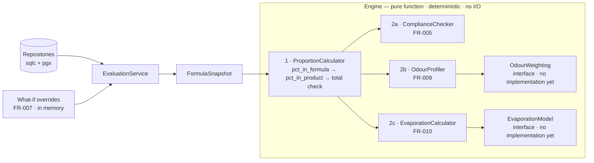
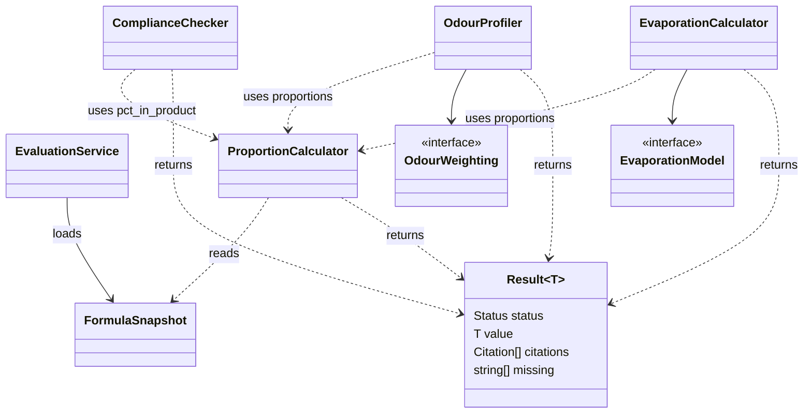
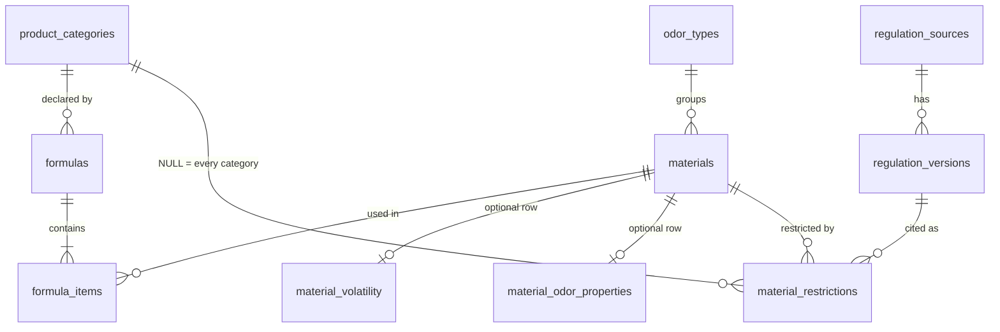

# Calculation Engine

The engine behind the formula view: what it reads, what it returns, where it sits in the server,
and which decisions are still open.

Derived from the Calculation Engine design page
(https://claude.ai/artifact/5j8UWYi94xz1YX371J72RB), which names this file as the repository
document holding the ER and class diagrams, the per-calculation rules and the traceability notes.
Where the two differ, this file governs (CLAUDE.md authority order); §10 lists the differences.
Companion to `data-model.md` (schema) and `diagrams.md` D3 (architecture). Structure only — no
dataset values appear here.

Stack: Go + Gin, PostgreSQL via sqlc + pgx (`diagrams.md` D3).

---

## 1. What it produces

Four outputs land on the formula view.

| Output | Requirement | Status |
|---|---|---|
| **Proportions** — each material as a share of the concentrate and of the finished product | FR-004 | Ready, assuming quantities in grams (decision 1). The discrepancy flag waits on decision 8 |
| **Restriction status** — within, near, over, or insufficient data, against a named regulation and version | FR-005 | Ready for restriction rows with a numeric limit. Rows without one (`prohibited`, `declarable`, `specification`, `listed`) wait on decision 10; which categories are checked waits on decision 6; the near state waits on decision 7 |
| **Odour profile** — composition grouped by odour family | FR-009 | Blocked on decision 2 (weighting basis) |
| **Evaporation curve** — predicted intensity per material over time | FR-010 | Blocked on decision 4 (model) |

**Not designed: material groups and material-pair checks.** FR-003 shows each material's
group(s), and FR-005 and CER-002 check material combinations. No output covers them: the supplied
data has no material-group or pair-rule fields (`.docs/00-context/dataset-structure.md` §1; the
odour type used by FR-009 is a separate field), and no table defines them (`data-model.md` §7,
decision 11). Until decision 11 is made, these acceptance
criteria are not met this cycle. Under CER-002 and rule.md rule 59, any pair check that is added
must return `insufficient data` for a pair with no rule, never a guess.

---

## 2. The result contract: `Result[T]`

Two requirements settle the design before any equation does. Every value must carry the rule,
threshold and source row that produced it (CER-001). Where the data does not cover a case, the
answer is `insufficient data` — never a guess and never a silent omission (CER-002).

Both fail if they are left to discipline, so they live in the return type of every calculator:

| Field | Meaning |
|---|---|
| `Status` | `ok` or `insufficient_data` |
| `Value` | The computed value. Empty when the status is `insufficient_data` |
| `Citations` | Rule, threshold and source row used. Never empty when the status is `ok` |
| `Missing` | The inputs that were absent. Filled only when the status is `insufficient_data` |

Example:

```
Status     ok                          Status     insufficient_data
Value      0.30 %                      Value      —
Citations  IFRA 51st Amendment,        Missing    material_volatility.antoine_a
           Category 4, limit 0.5 %     Citations  (none)
```

- A number cannot reach the API without its sources attached.
- "We don't know" has exactly one representation. It is never `0` and never an omitted value, and
  it names the absent input.
- The explanation panel (FR-006) reads the citations already attached to the result; it does not
  run a second lookup. No separate explanation route is defined.

---

## 3. Where the engine sits

| Part | Does | I/O |
|---|---|---|
| `EvaluationService` (in the Formula module) | Loads a `FormulaSnapshot` through the repositories (sqlc + pgx) and applies what-if overrides | The only I/O on the calculation path |
| Engine | Computes every output from the snapshot | None: no database call, no socket, no clock |

The engine is a pure, deterministic function over a loaded snapshot: the same input always gives
the same output (CER-003). It calls no external AI or model service (NFR-004).

A what-if edit (FR-007) sends overrides that `EvaluationService` applies to the snapshot in
memory. The same engine then runs again, so the recalculated view cannot drift from the stored
view, and the recalculation itself writes nothing. Whether a trial edit can later be saved is
`backlog.md` Open Question 7.

This placement follows the Calculation Engine page, as directed on 2026-09-29. `diagrams.md` D3
follows it. The Backend Map page (https://claude.ai/artifact/JoF8PwkdQNxjJQZ3cLsjZk) still draws
its gate chain as handler → engine → sqlc + pgx and needs the same change.



---

## 4. Order of computation

Proportions run first, always. Compliance compares a diluted percentage, the odour chart weights
by concentration, and evaporation intensity is relative to concentration, so none of them can run
on raw quantities. The pipeline is one sequential step followed by a fan-out.

Two branches end at an interface with nothing behind it yet. That is deliberate: the missing
piece is a domain judgement, so filling it in later is a swap rather than a rewrite.

| Interface | Must provide | Blocked by |
|---|---|---|
| `OdourWeighting` | The weighting it applies, as a label shown on the chart, because mass percentage and odour units give visibly different charts from the same data | Decision 2 |
| `EvaporationModel` | Its own equation and assumptions, retrievable per curve (FR-010), including surface area and airflow defaults that the dataset does not supply | Decision 4 |

Compliance needs no interface; its open points are decisions 6, 7 and 10.

### Class diagram

Names only; method signatures are left to implementation.



---

## 5. The data it reads

Only the tables on the calculation path. Names follow `data-model.md`.

| Table | Columns the engine uses | Notes |
|---|---|---|
| `formulas` | `id`, `org_id`, `product_category_id`, `concentrate_in_product_pct` | Tenant-scoped, with its items |
| `formula_items` | `formula_id`, `material_id`, `quantity` | Grams assumed (decision 1) |
| `materials` | `cas`, `name`, `mw_g_mol`, `nist_identified`, `nist_confidence`, `odor_type_id` | Provenance for CER-001 |
| `material_volatility` | `psat_25c_pa`, `psat_32c_pa`, `antoine_a`, `antoine_b`, `antoine_c`, `antoine_form`, `antoine_tmin_k`, `antoine_tmax_k`, `hvap_25c_kj_mol`, `d_air_m2_s` | Optional row. The exact columns depend on decision 4 |
| `material_odor_properties` | `odt`, `tenacity_hours`, `odor_strength` | Optional row |
| `odor_types` | `name` | Groups materials by family (FR-009) |
| `material_restrictions` | `category_id` (nullable), `regulation_version_id`, `restriction_type`, `max_concentration_pct`, `citation` | Fans out per product category |
| `product_categories` | `code` | The formula's category is the join key |
| `regulation_versions` | `source_id`, `label`, `effective_from`, `effective_to` | Picks the version in force |
| `regulation_sources` | `code`, `name` | Names the regulation in every citation (FR-005) |

- The volatility and odour rows are optional. Their absence is the ordinary source of
  `insufficient data`, not an error.
- Materials and regulatory tables carry no `org_id`; they are shared reference data.
- Accounts, consent and the access log are outside the calculation path. Supplier documents exist
  in the schema, but nothing in this cycle reads them.



---

## 6. Per-calculation rules

**Proportions (FR-004).** The dilution is applied exactly once and both figures are returned
(`data-model.md` §5):

```
pct_in_formula = item.quantity / SUM(item.quantity) * 100
pct_in_product = pct_in_formula * concentrate_in_product_pct / 100
```

Example: 2.00 % of the concentrate × 15 % concentrate in the finished product = 0.30 % of the
product, which is within a 0.5 % limit. Skipping the dilution compares 2.00 % against 0.5 % and
reports a false violation.

A missing input blanks exactly the values that depend on it. When `concentrate_in_product_pct` is
not recorded, `pct_in_product` and the restriction status return `insufficient data` naming that
input; `pct_in_formula` is still shown.

**Restriction status (FR-005).** Match the formula's product category, compare `pct_in_product`
against `max_concentration_pct`, and cite the regulation, version and threshold. A formula with no
product category returns `insufficient data` naming it. The near band (decision 7) and rows
without a numeric limit (decision 10) are undefined.

**Odour profile (FR-009).** Group the formula's materials by `odor_types` and weight them through
`OdourWeighting` (decision 2). A material with no odour type is reported as `insufficient data`,
never assigned to a family.

**Evaporation curve (FR-010).** Computed on request through `EvaporationModel` (decision 4). A
material without volatility parameters, or a temperature outside its stated Antoine range, returns
`insufficient data` or a flagged extrapolation (decision 5), never an unmarked estimate.

---

## 7. Open decisions

Decisions 1–6 carry over from the schema design. Decision 7 is a case where a requirement asks for
behaviour that no approved source defines; filling it in would invent a domain rule. Decision 8 is
a data-model choice for the team. Decisions 9–11 are recorded in `data-model.md` §7 with the same
numbers.

| # | Decision | Blocks | Owner |
|---|---|---|---|
| 1 | Quantities in grams, or obtain a density column | Proportions, if any formula uses volume | Team |
| 2 | Odour bar height: mass percentage or odour units | FR-009 | Stakeholder |
| 3 | Numeric mapping for categorical odour strength | FR-009, if strength is used | Stakeholder |
| 4 | Which evaporation equation, and its assumptions | FR-010 entirely | Stakeholder |
| 5 | Behaviour outside the Antoine validity range | FR-010 at skin temperature | Stakeholder |
| 6 | Which product categories the system checks against | FR-005 | Stakeholder |
| 7 | The "near limit" band — what share of a limit counts as near | FR-005's near state only | Stakeholder |
| 8 | Whether a formula declares an expected total or batch size | FR-004's discrepancy flag; the batch-size example in FR-007 | Team |
| 9 | A version column on `formulas`, and what creates a version | Log and export rows that record `formula_id` + version | Team |
| 10 | How rows without a numeric limit map onto the four states | FR-005 for those rows | Stakeholder |
| 11 | Material groups and material-pair checks | The group and pair criteria in FR-003, FR-005, CER-002 | Stakeholder |

On decision 8: as written, FR-004's discrepancy check can only fire on rounding; it becomes
meaningful only if a formula declares an expected total or batch size.

---

## 8. Build order

Ranked so that nothing waits on an undecided domain call.

1. **Result envelope** — snapshot loading, `Result[T]` and the citation type. No blockers;
   testable against fixtures alone.
2. **Proportions (FR-004)** — unblocked, assuming grams (decision 1); only the discrepancy flag
   waits on decision 8.
3. **Restriction status (FR-005)** — the largest cost, though not the hardest engineering: the cost
   is extracting the IFRA Standards spreadsheet into `material_restrictions` rows. Within, over and
   insufficient data work for rows with a numeric limit before decision 7 lands; rows without one
   wait on decision 10, and which categories are checked waits on decision 6.
4. **Odour profile (FR-009)** — build the interface; implement a weighting once decision 2 is
   made.
5. **Evaporation (FR-010)** — the interface is the deliverable until decision 4 is made.

---

## 9. Traceability

| Requirement | Where it lands |
|---|---|
| FR-004 | §1, §6 Proportions |
| FR-005 | §1, §5, §6 Restriction status; decisions 6, 7, 10, 11 |
| FR-006 | §2 — citations carried on `Result[T]` |
| FR-007 | §3 — in-memory overlay, same engine |
| FR-009 | §4 `OdourWeighting`, §6; decision 2 |
| FR-010 | §4 `EvaporationModel`, §6; decisions 4, 5 |
| FR-003 (groups), FR-005 and CER-002 (pairs) | §1 — not designed; decision 11 |
| CER-001 | §2 `Citations` |
| CER-002 | §2 `insufficient_data` + `Missing` |
| CER-003 | §3 — pure function over a snapshot |
| NFR-004 | §3 — no AI or model call |

---

## 10. Differences from the Calculation Engine page

The page should be corrected on these points.

| Page says | This file |
|---|---|
| `material_odor_props` | `material_odor_properties` (`data-model.md` §3) |
| Example cites `materials.antoine_a` | The column is in `material_volatility` |
| Read set omits `odor_types`, `regulation_sources` and the vapour-pressure, enthalpy and diffusion columns | Added in §5 |
| Restriction status "Ready" | Partly ready; see §1 |
| "Only `pct_in_product` goes unknown" when the dilution is missing | The restriction status goes unknown too (§6) |
| Refers to an explanation endpoint | No such route is defined; FR-006 reads the attached citations (§2) |
| "Four decisions that are not ours to make" | Its own table has six stakeholder rows |
