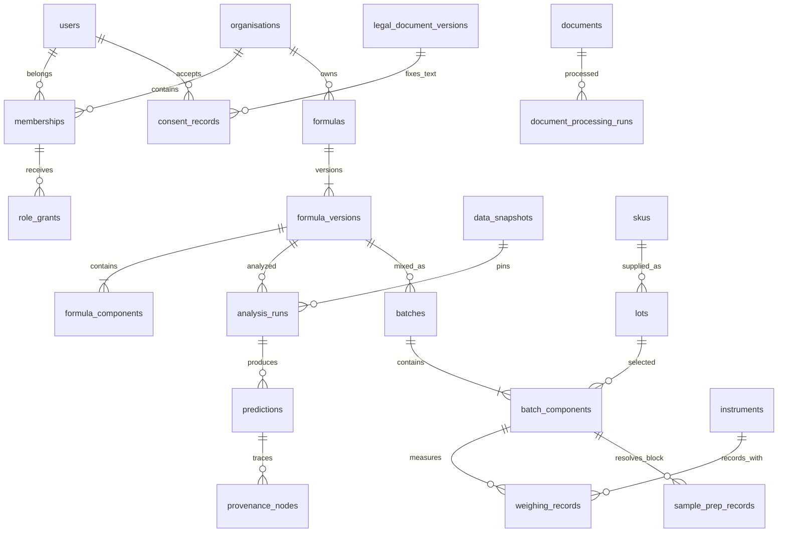

<!-- AI Perfumery Engine project documentation; ownership follows the owner's existing agreement. No new licence is granted. -->
# Data Model — MVP Waves 0–5

**Updated:** 2026-10-04. This is a PostgreSQL **schema proposal**, accessed through sqlc + pgx; no tables, migrations or production data are created by this document. It supersedes the 2026-09-10 narrow formula-view model under the owner's scope decision in [mvp-scope.md](mvp-scope.md). Honney's stack remains [tech-stack.md](tech-stack.md).

Sources: Honney [dataset-structure.md](../00-context/dataset-structure.md) (field structure only), [rule.md](../03-compliance/rule.md), and frontend commit `aa572abaede14c11796a1551434858171eb37363` `api/openapi.yaml`, R1/R2/J15/X3/X1/X4 wireframes. Source fixtures and proposed domain values are not production observations. Permission mapping is [roles-permissions.md](roles-permissions.md); result contracts/pipeline are [calculation-engine.md](calculation-engine.md).

## 1. Schema-wide conventions

- Tenant-owned records carry `org_id`; child foreign keys must enforce the same tenant and parent. Shared reference records have explicit scope/visibility. Server queries still perform action/record checks; a schema column alone does not enforce authorization.
- Formula percentages and measured inputs arrive as decimal strings. Preserve the exact entered text/scale alongside a reviewed PostgreSQL decimal representation. Do not use binary floating-point equality to validate declared totals. Decimal precision/scale and Go numeric implementation remain engineering decisions.
- Store reference/source version and conditions with observations. Missing values are absent with a reason, never manufactured zeros. No real dataset values appear in this design or public demo seeds.
- Personal-data tables/records, including creator/editor/reviewer/measurement actor links, require `purpose_code`, `consent_id`, `created_at`, `retention_until`, and documented erasure/retention treatment. Tables below list domain columns; these common fields must be included wherever personal data exists. Signature/log evidence follows its separately defined lawful retention rules.
- Snapshots, saved formula versions, measured evidence and signatures are immutable records. Operational status/current pointers can update; an update must never overwrite the earlier source, formula content, measured observation or acceptance evidence.
- Names in this proposal need a reviewed migration/API field map before implementation. `org_id` is the local name for the source contract's `tenant_id`; `concentrate_in_product_pct` is the local finished-product dilution mapped explicitly to API `concentration_pct`.

## 2. Identity, consent and access (wave 1)

| Proposed table | Core fields/responsibility |
|---|---|
| `organisations` | `id`, `name`, status; no SaaS billing/onboarding fields |
| `users` | `id`, `display_name`, `email`, `password_hash` or approved provider reference, verification/deactivation state; only necessary profile fields |
| `memberships` | `id`, `org_id`, `user_id`; active-context eligibility |
| `role_grants` | `id`, `org_id`, `user_id`, fixed `role_id`, granted/revoked event references and reason; no arbitrary role editor |
| `legal_document_versions` | `id`, type, version, immutable text/storage reference, content hash, effective date; exact terms/privacy text |
| `consent_records` | `id`, `user_id`, purpose, document-version/hash, deliberate acceptance evidence, `withdrawn_at`; withdrawal does not erase evidence |
| `agreement_signatures` | signer reference/name-at-signing, exact document version/hash, server signing time, auth method, IP/user-agent, prior correction reference and record hash; append-only |
| `sessions` | opaque session-token digest, `user_id`, active `org_id`, server creation/expiry/revocation/last-seen times and coarse device metadata |
| `auth_challenges` | verification/invitation/reset/MFA/step-up purpose, token digest, bound identity/session, expiry and consumed state; never raw secrets |
| `mfa_credentials`, `mfa_recovery_codes` | protected TOTP secret reference, enrollment state; recovery-code digests and consumption evidence |
| `account_preferences`, `tutorial_progress` | own locale/tip settings and synthetic quest progress; no confidential formula cache |
| `erasure_requests`, `pending_backup_purge` | execution/status/evidence and scheduled backup purge date; not a substitute for real rights endpoints |

Signup creates consent/acceptance evidence before or atomically with personal-profile persistence; no null-consent bypass. Invited personal data needs its own approved processing purpose/basis before storage. `pending_approval` is derived from verification/active/no-role state, not an independent grant. `memberships` may support the source's context picker, while public signup uses a server-configured tenant rather than a client-chosen organisation.

Roles/MFA policy follow the seven identifiers in [roles-permissions.md](roles-permissions.md). No role proves legal reviewer qualification. Credential evidence policy and first-administrator bootstrap remain `insufficient information`; no extra identity/sensitive fields are added here.

## 3. Formula identity and immutable versions (wave 2)

| Proposed table | Core fields/responsibility |
|---|---|
| `formulas` | `id`, `org_id`, stable code, current-version pointer, creator reference; identity only |
| `formula_versions` | `id`, `org_id`, `formula_id`, version/parent-version, name/intent snapshot, creator reference, content hash, vehicle/version reference, concentration class, nullable `concentrate_in_product_pct`, product-category/version reference, application inputs |
| `formula_components` | `id`, `org_id`, formula-version id, component type (`sku`, `molecule`, `subformula`), exact target reference/version, declared `pct_by_mass` text/decimal, source/grade snapshot |
| `formula_coauthors` | formula/user link and primary/contributor designation; supports source `mine` filter, not an exclusive tenant read boundary |
| `vehicles`, `vehicle_components` | system/personal/organisation visibility, reviewed vehicle class, standard carrier-source references and scope status |

Enforce unique `(formula_id, version)` and tenant-consistent references. A component references exactly one appropriate subject, not an arbitrary unchecked polymorphic id. Subformula references pin an immutable version; reject unresolved references and cycles. Nesting/depth/composition limits need an approved contract, not invented constraints.

The workspace accepts w/w percentages, not volume percentages. The server checks the declared component sum is exactly 100%; a failure returns the official sum/difference and never silently normalizes. Create produces version 1; modify checks `base_version` and appends a new version or returns conflict. Product category, vehicle or application changes also create a version. The earlier question whether explicit trial edits can save is resolved by separate version-saving behavior (FR-007/FR-011).

For existing gram-based input, proportions follow the established mass-share calculation before mapping to w/w. Missing density never licenses conversion from volume to mass. Finished-product dilution applies exactly once: the formulation share and final-product share remain distinct; missing dilution or category makes dependent compliance inconclusive/missing rather than assuming 100% or an arbitrary category. How vehicles/pre-diluted SKUs/carryover combine into the denominator requires a reviewed domain mapping; no double dilution or silent exemption.

A what-if request overlays a loaded snapshot in memory and creates no stored formula version. An explicit save revalidates the input through the version-creation action; analysis evidence and access events may persist separately. Do not describe that entire request as writing nothing if it writes its required log.

## 4. Materials, SKUs, lots and reviewed observations

| Proposed table | Core fields/responsibility |
|---|---|
| `materials` | chemical identity: CAS/name/formula/SMILES/InChIKey/source identifiers/MW; imported dataset field names map explicitly |
| `suppliers`, `skus`, `sku_composition` | supplier identity, SKU code/content type/grade, reviewed component and dilution/carrier references; supplier identity is not a chemical material |
| `lots` | scoped SKU id, lot code, received/expiry information and lot-specific sources |
| `property_definitions`, `observations` | property/unit, material/SKU/lot subject, value or missing reason, experimental conditions, source/version/locator, uncertainty/method/tier only when supported |
| `odor_types`, `material_odor_descriptors`, `material_odor_properties` | controlled vocabulary and source properties; categorical strength is not silently mapped to numbers |
| `material_volatility` | source pressure/temperature units, Antoine form/coefficient validity, source vapor-pressure/enthalpy/diffusion properties; versioned provenance |
| `data_snapshots`, `snapshot_members` | immutable reference/rule/document/observation versions selected for a run; content hash |
| `model_versions` | approved model id/version, equation/assumptions/applicability and citation references; not model training or a network service |

The supplied dataset lacks confirmed density, material-group and pair-rule data. A generalized observation table does not fill those gaps. Group/pair tables can be introduced after expert definitions/sources exist; until then checks return `insufficient data`. Reference-data curation/edit approval screens remain outside MVP despite `data_curator` being a role.

## 5. Analysis, results and provenance (wave 2)

| Proposed table | Core fields/responsibility |
|---|---|
| `analysis_runs` | `id`, `org_id`, pinned formula version, mode, explicit seed, snapshot id/hash, model-version set, status/start/end, cache identity |
| `analysis_steps` | run id, module/substep id, pending/running/done/failed/unquantified state and safe missing/reason code |
| `predictions` | run id, endpoint/profile, `Result` status, serialized exact/estimated/missing value, unit/display policy, interval/tier/model references if supported |
| `prediction_error_budget` | prediction id, contributor, sourced share, reducibility and provenance reference; no guessed sensitivity percentages |
| `provenance_nodes`, `provenance_edges` | prediction/observation/document/model/assumption/input nodes, source/version/locator, reviewed value/method/uncertainty and all child links |
| `compliance_reports`, `compliance_findings` | formula version/snapshot/rule versions, jurisdiction, finding/rule id, status/citation completeness, disclaimer version, sourced hard-block evidence |

Cache keys include tenant/authorized context, immutable formula content/version, data/rule snapshot, model versions, explicit application/config and seed; no stale response keyed only by formula id. Formula changes and model changes are separate indicators. Results retain their run identity; unavailable intervals, tiers or models become missing states rather than fabricated `ReportedValue` envelopes.

Profile A/B and time-scale views reference the same pinned evidence. Storing a run's returned curves/provenance for reproducibility does not mean replacing a selected model with frozen import-time curves. Recalculate only through the Go service/engine, never in Next.js.

## 6. Regulatory rules and categories (wave 4)

`regulation_sources`, `regulation_versions` and `product_categories` retain named scheme/version, effective dates, jurisdiction and string category codes. `material_restrictions` links subject/version/category, rule kind, numerical threshold and basis/unit when applicable, conditions, document/locator and review provenance. Numeric thresholds must carry semantics: maximum restriction, declaration trigger, specification or other approved comparator. `listed` is not a pass and an allergen declaration trigger is not a generic maximum concentration.

A compliance report contains distinct EU/TH/ASEAN/US blocks, including visible unbound/no-data states, plus separate other checks. It has no invented overall compliant flag. Inconclusive intervals remain separate from pass/exceed. A real prohibition/hard block needs reviewed applicable rule/citation and is enforced server-side; no jurisdiction override is inferred from the upstream pending target-market proposal.

Supported rule sets/categories, interval-aware evaluation, concentration/carryover basis, rule-tier/review/credential classes and warning/hard-block semantics remain domain/legal gates when local evidence is missing. Displaying these four jurisdictions does not claim four validated rule datasets exist.

## 7. Laboratory batches and unit bridge (wave 3)

| Proposed table | Core fields/responsibility |
|---|---|
| `batches` | `id`, `org_id`, immutable formula-version id, declared target mass/date, operational state/lock evidence; no production-release approval implied |
| `batch_components` | batch/formula-component/lot references, canonical target mass, declared dosing unit and explicit selected instrument |
| `instruments`, `instrument_calibrations` | scoped instrument/type/model, sourced readability/input decimals, qualification/calibration-due status and evidence |
| `weighing_records` | component/instrument/calibration snapshot, entered decimal text/unit, measured mass envelope/missing reason, server-derived uncertainty/verdict, actor/time, superseded-record reference and reweigh reason |
| `sample_prep_records` | `org_id`, blocked component, explicit diluent lot/dilution input, calculated new target/provenance and new weighing-row reference |
| `dropper_calibrations` | source calibration for material/SKU/lot and dropper pair, conditions/value/uncertainty/validity; no universal drops-per-mL constant |
| `lab_pdf_artifacts` | batch/version/run identity, language/layout/document hash and authorized storage reference for mixing sheets/QR labels |

Batch creation selects a lot for each formula component and computes canonical targets on the server. The user selects an instrument per item; a suggestion is never a preselection. Reject expired/unqualified instruments; typed decimals cannot exceed instrument input precision. Measurements persist even when the server verdict is BLOCK; the next batch step locks. Reweighing appends a new record/reason and leaves the earlier record visible. A documented pre-dilution creates preparation/new-row evidence; no role can skip a BLOCK.

Mass/volume/drop conversions require the actual sourced density with its uncertainty/conditions and pair-specific dropper calibration. Unsupported conversions return `no_data`/`needs_calibration`, never an assumed density or drop constant. Approved uncertainty propagation, WARN/BLOCK cutoffs, calibration validity and drop quantization are still domain decisions; source demonstration tolerances are not adopted production numbers. Automated instrument connections, offline synchronization and deriving a new formula from actual measurements remain deferred.

## 8. Typed documents and processing (wave 4)

`documents` stores `id`, visibility/`org_id`, exact bytes hash/protected storage reference, type/title/issuer/version, issue/upload evidence and superseded-document reference. `document_subjects`/typed constraints bind COA/GC-MS/chiral GC to lots and SDS/TDS/IFRA CoC/allergen declarations to SKUs. `document_processing_runs` and `document_processing_events` record queued → scanning → parsing → done/rejected and safe rejection codes; processing status is separate from immutable file content.

New SDS/other revisions append documents and preserve earlier versions; the current pointer never deletes evidence. Parsed text is plain text and an unverified parse does not become an approved observation/rule. Calibration certificates/`other` subject rules are not fully supplied by the SKU/lot-only source contract: `insufficient information`; gate those attachments until defined instead of guessing an instrument route.

`document_completeness` can be a computed view/result by subject and formula-used SKU/lot, with its scoring-policy version/citations. It is informational, not a new blocking score. No weights are invented. File storage, allowed type/size limits, malware scanning and parser service/library are unselected; no upload reaches a parser before checks and quarantine. Downloads recheck subject permission and licence; storage references are not public bearer links.

## 9. Access logs, erasure and retained evidence

Proposed `access_log` fields: `event_id`, actor/minimal retained-identity or pre-auth session reference, role/context used, `org_id`, source IP, user-agent, server UTC time, action, target type/id/version, success/failure, safe reason, previous hash/current hash. Logs record metadata, not formula content, typed passwords/OTP/tokens or parsed documents. Application role receives INSERT/SELECT only; retention purge uses a separate scheduled role and tamper-evident procedure. Restricted reads/exports log the query actor and range.

`retained_identity` preserves the minimal identity needed for the required post-account log period in restricted storage. Retention and legal holds follow current `rule.md`/LR2, not an upstream unspecified value. On account erasure, remove/revoke derived profile/session/preferences/tutorial/cache records, detach unnecessary authorship identity, preserve only justified signature/log evidence and schedule `pending_backup_purge`. The migration/deletion plan must list each kept/deleted table and retention basis. Immutable business records do not justify retaining full profiles indefinitely.

Backups include durable logs/evidence and restore tests; logs cannot live only in an ephemeral Docker filesystem. Server time is UTC with Asia/Bangkok display. Incident/defect evidence required by `rule.md` needs a minimal documented retention/purpose model before implementation. Evaluation panels, health/religion/patch-test data, client contacts, billing and Certificate Authority tables are outside this MVP.

## 10. Relationship overview

## 11. Readiness and checks

Implement by wave with the full applicable consent/access/evidence controls, rather than creating every proposed table up front. Required checks cover immutable version/concurrency behavior, exact percentage sums, typed tenant-safe references, reproducible cache identities, full provenance, append-only weighing/doc revisions, conversion missing states, non-bypassable blocks, authorization and erasure/retention/backup behavior.

The open implementation decisions are precision/serialization, schema/API field map, migrations, reference visibility/licensing, file/PDF/scanner services, auth/step-up/retention operations, and reviewer credential policy. Domain gates are missing models/uncertainty/tiers/pair rules/density/calibration/regulatory semantics. Resolve them through the backlog and expert/owner review; the wider schema proposal is not proof that these decisions or sources exist.
