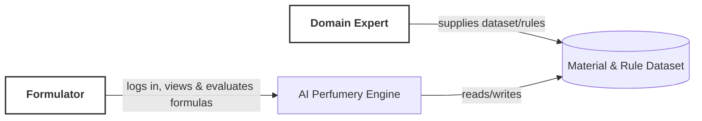
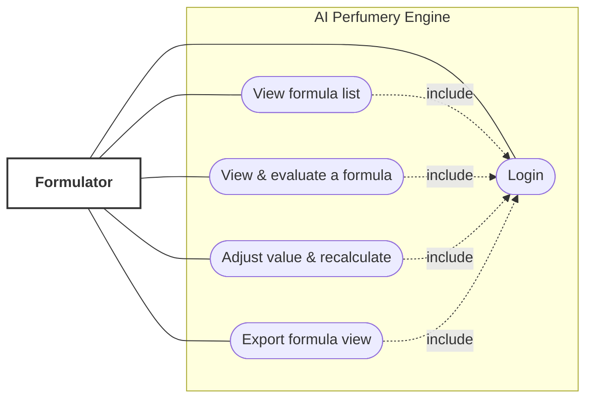
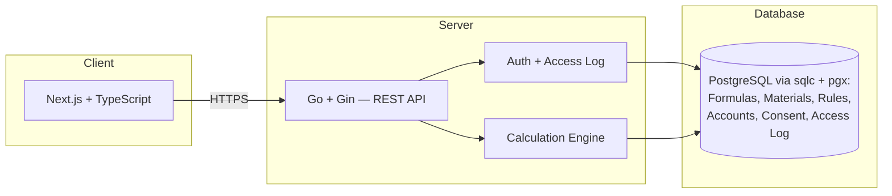
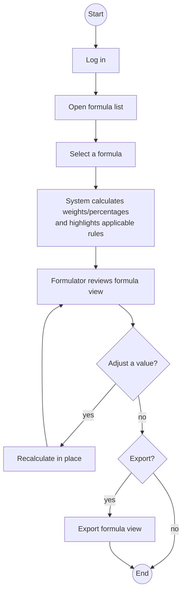

# Diagrams (D1–D4)

All four diagrams describe the same system and the same one core workflow as
`feature-list.md`/`user-journey.md`: primary actor **Formulator**, system **AI Perfumery Engine**.
Rendered as Mermaid (GitHub and most Markdown viewers render these natively); source diagram tool
alternatives (draw.io/Figma/PlantUML) can replace these later without changing what they show.

**Domain Expert** appears only in D1, as the external source of the material/rule dataset (rule.md
§0) — not as a system use case; see `backlog.md` §2 Users for why.

## D1 — System Context

What it shows: the system as one box, plus the actors and data store outside it. No internal
detail — just the boundary.

## D2 — Use Case

What it shows: which actor can do what. The core use case ("View & evaluate a formula") is
central and includes Login, matching the journey's step order. Domain Expert is not shown here —
this cycle has no in-app use case for that role (see note above). The odour profile chart and
evaporation curve (FR-009, FR-010) are part of UC3, not separate use cases. Formulator is a user
with the `member` role (`roles-permissions.md` §3).

## D3 — High-Level Architecture

What it shows: layers and data direction, now naming the chosen stack (table below) — this
supersedes the earlier "no stack decided yet" placeholder (`project-context.md` §29 is stale on
this point as of this decision).

### Tech Stack

| Layer | Choice | Why |
|---|---|---|
| Frontend | Next.js + TypeScript | Strong web UI, routing, forms, SSR when useful, excellent TypeScript ecosystem |
| Backend | Go + Gin | Simple, fast, strongly typed, excellent for APIs and calculation/business logic |
| Database | PostgreSQL | Excellent relational modeling, constraints, transactions, JSON support |
| DB access | sqlc + pgx | Type-safe SQL without hiding SQL behind a heavy ORM |
| API | REST | Simple and appropriate for this product |
| Auth | Managed auth or secure session-based auth | Avoid building authentication from scratch (still open which of the two — see note below) |
| Containerization | Docker | Consistent development and deployment |
| Cloud | Railway (was Google Cloud Run + Cloud SQL) | Simple container deployment with managed infrastructure |
| CI/CD | GitHub Actions | Easy automated testing/deployment |
| Testing | Go tests + Playwright + Vitest | Backend, end-to-end, and frontend coverage |

Auth is the one line still open: "managed" (a third-party identity provider) vs. self-rolled
session-based auth in Postgres are different enough in data ownership and portability that this
should be pinned down as a real decision, not left as "or," before it's built.

## D4 — Activity

What it shows: one scenario, start to end — the same steps as `user-journey.md`, including the
two optional branches (what-if edit loops back to review; export is optional before end).

