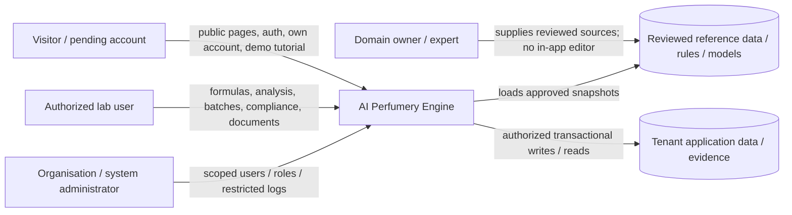
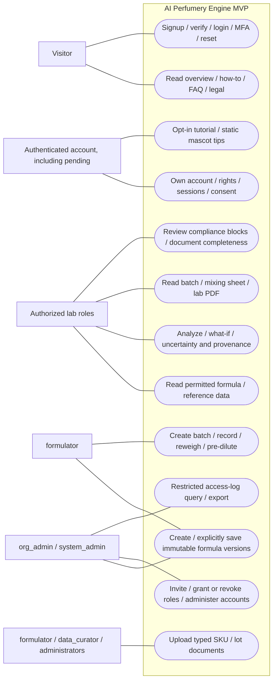
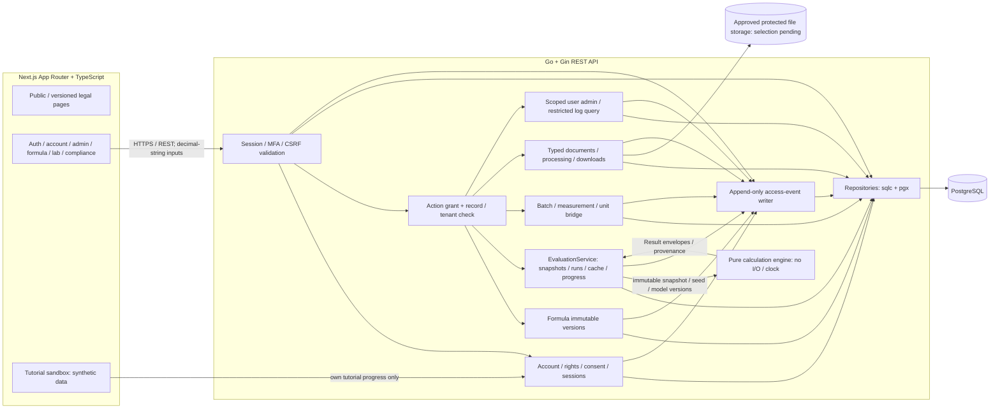
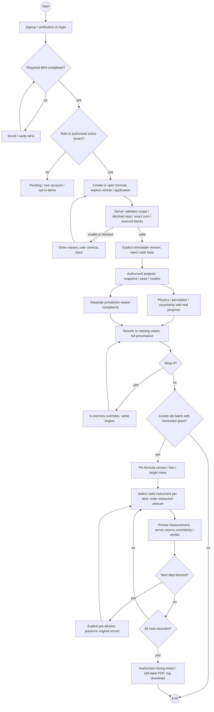

<!-- AI Perfumery Engine project documentation; ownership follows the owner's existing agreement. No new licence is granted. -->
# Diagrams (D1–D4)

**Updated:** 2026-10-04. These diagrams describe [mvp-scope.md](mvp-scope.md), adopting the source frontend's waves 0–5 with [Honney's technology stack](tech-stack.md). They replace the 2026-09-16 single formula-view workflow. Actors/actions follow [roles-permissions.md](roles-permissions.md); requirements follow [../01-requirements/backlog.md](../01-requirements/backlog.md). They describe the target design, not deployed components.

## D1 — System context

Public/pending access and the authorized lab boundary are different. The domain owner supplies reviewed data/models through approved infrastructure; a reference-data editor is outside this MVP.

```mermaid
flowchart LR
    PUBLIC[Visitor / pending account]
    LAB[Authorized lab user]
    ADMIN[Organisation / system administrator]
    EXPERT[Domain owner / expert]
    SYSTEM[AI Perfumery Engine]
    REFERENCE[(Reviewed reference data / rules / models)]
    STORE[(Tenant application data / evidence)]
    PUBLIC -->|public pages, auth, own account, demo tutorial| SYSTEM
    LAB -->|formulas, analysis, batches, compliance, documents| SYSTEM
    ADMIN -->|scoped users / roles / restricted logs| SYSTEM
    EXPERT -->|supplies reviewed sources; no in-app editor| REFERENCE
    SYSTEM -->|loads approved snapshots| REFERENCE
    SYSTEM -->|authorized transactional writes / reads| STORE
```

No public edge reads the reference/tenant stores. An email/identity/file/hosting provider may be added only after its engineering decision, owner-IP approval and privacy transfer review. None is shown as an already approved service.

## D2 — MVP use cases

The lab actor represents seven fixed role identifiers; each case is filtered by action grants and record checks. The graph does not give all roles every write action. `approver`, `safety_assessor` and `legal_reviewer` do not introduce deferred production/credential/signature workflows.

```mermaid
flowchart LR
    Visitor[Visitor]
    Account[Authenticated account, including pending]
    Lab[Authorized lab roles]
    Formulator[formulator]
    Admin[org_admin / system_admin]
    Uploaders[formulator / data_curator / administrators]
    subgraph SYS[AI Perfumery Engine MVP]
        Public([Read overview / how-to / FAQ / legal])
        Auth([Signup / verify / login / MFA / reset])
        Own([Own account / rights / sessions / consent])
        Tutorial([Opt-in tutorial / static mascot tips])
        Read([Read permitted formula / reference data])
        Author([Create / explicitly save immutable formula versions])
        Analyze([Analyze / what-if / uncertainty and provenance])
        LabRead([Read batch / mixing sheet / lab PDF])
        Weigh([Create batch / record / reweigh / pre-dilute])
        Compliance([Review compliance blocks / document completeness])
        Upload([Upload typed SKU / lot documents])
        Users([Invite / grant or revoke roles / administer accounts])
        Logs([Restricted access-log query / export])
    end
    Visitor --- Public
    Visitor --- Auth
    Account --- Own
    Account --- Tutorial
    Lab --- Read
    Lab --- Analyze
    Lab --- LabRead
    Lab --- Compliance
    Formulator --- Author
    Formulator --- Weigh
    Admin --- Author
    Admin --- Users
    Admin --- Logs
    Uploaders --- Upload
```

FR-008 scoped formula export is a local extension to the handoff, available to the seven domain roles for readable snapshots; its permitted content/format must be completed before implementation. Restricted administrator log queries ship with auth/LR2 even though the full X4 audit dashboard is deferred. Both routes are defined in [api-contract.md](api-contract.md).

## D3 — High-level architecture

```mermaid
flowchart LR
    subgraph CLIENT[Next.js App Router + TypeScript]
        STATIC[Public / versioned legal pages]
        UI[Auth / account / admin / formula / lab / compliance]
        DEMO[Tutorial sandbox: synthetic data]
    end
    subgraph SERVER[Go + Gin REST API]
        AUTH[Session / MFA / CSRF validation]
        PERM[Action grant + record / tenant check]
        ACC[Account / rights / consent / sessions]
        ORCH[EvaluationService: snapshots / runs / cache / progress]
        ENGINE[Pure calculation engine: no I/O / clock]
        FORM[Formula immutable versions]
        LAB[Batch / measurement / unit bridge]
        DOC[Typed documents / processing / downloads]
        ADMIN[Scoped user admin / restricted log query]
        LOG[Append-only access-event writer]
        DATA[Repositories: sqlc + pgx]
    end
    DB[(PostgreSQL)]
    FILES[(Approved protected file storage: selection pending)]
    UI -->|HTTPS / REST; decimal-string inputs| AUTH
    AUTH --> ACC
    AUTH --> PERM
    PERM --> FORM
    PERM --> ORCH
    PERM --> LAB
    PERM --> DOC
    PERM --> ADMIN
    DEMO -->|own tutorial progress only| ACC
    FORM --> DATA
    ORCH --> DATA
    ORCH -->|immutable snapshot / seed / model versions| ENGINE
    ENGINE -->|Result envelopes / provenance| ORCH
    LAB --> DATA
    DOC --> DATA
    DOC --> FILES
    ACC --> DATA
    AUTH --> DATA
    ADMIN --> DATA
    AUTH --> LOG
    FORM --> LOG
    ORCH --> LOG
    LAB --> LOG
    DOC --> LOG
    ACC --> LOG
    ADMIN --> LOG
    LOG --> DATA
    DATA --> DB
```

The pure Go engine cannot query sqlc/pgx, open files, call a network/model service or read wall-clock time. Services supply snapshots and explicit time/config/seed, persist evidence and log actions. Compliance and physical/perceptual calculations are separate blocks; missing physics never implies compliant or noncompliant status. The API adapts internal `Result[T]` to sourced `ReportedValue`, `Quantity` or `MissingValue` ([calculation-engine.md](calculation-engine.md)).

Next.js renders/submits input; it does not calculate official totals, conversions, verdicts, intervals or curves. Confidential responses must not enter public shared caches, static builds, telemetry or persistent browser stores. The synthetic tutorial cannot reach domain endpoints. Documents remain quarantined through approved scanning/processing; UI/parser output never executes uploaded HTML.

PostgreSQL stores identity/consent/session evidence, immutable formula/reference snapshots, runs/provenance, batches/measurements, document metadata and retained access records ([data-model.md](data-model.md)). Application/log-purge database roles have separate powers. Authorized file streaming/PDF production stays in Go; storage/scanner/PDF library selections are unresolved.

The repository retains `src/frontend/` and `src/backend/`; Docker packages Next.js/Go deployables. GitHub Actions runs Go tests, Vitest and Playwright once executable projects exist. Railway remains a candidate subject to owner approval and transfer review. This revision adopts no Vite, Mantine, Python/FastAPI, ReportLab, desktop/offline runtime or unselected library/version.

## D4 — Main activity: formula to lab evidence

```mermaid
flowchart TD
    Start((Start)) --> Session[Signup / verification or login]
    Session --> MFA{Required MFA completed?}
    MFA -->|no| Setup[Enroll / verify MFA]
    Setup --> MFA
    MFA -->|yes| Access{Role in authorized active tenant?}
    Access -->|no| Pending[Pending / own account / opt-in demo]
    Access -->|yes| Editor[Create or open formula; explicit vehicle / application]
    Editor --> Save[Server validates scope / decimal input / exact sum / sourced blocks]
    Save -->|invalid or blocked| Fix[Show reason; user corrects input]
    Fix --> Editor
    Save -->|valid| Version[Explicit immutable version; reject stale base]
    Version --> Analyze[Authorized analysis: snapshot / seed / models]
    Analyze --> Physics[Physics / perception / uncertainty with real progress]
    Analyze --> Compliance[Separate jurisdiction-aware compliance]
    Physics --> Result[Results or missing states; full provenance]
    Compliance --> Result
    Result --> Trial{What-if?}
    Trial -->|yes| Overlay[In-memory overrides; same engine]
    Overlay --> Result
    Trial -->|no| Batch{Create lab batch with formulator grant?}
    Batch -->|no| Finish((End))
    Batch -->|yes| Targets[Pin formula version / lots / target mass]
    Targets --> Measure[Select valid instrument per item; enter measured amount]
    Measure --> Record[Persist measurement; server returns uncertainty / verdict]
    Record --> Block{Next step blocked?}
    Block -->|yes| Prep[Explicit pre-dilution; preserve original record]
    Prep --> Measure
    Block -->|no| Complete{All rows recorded?}
    Complete -->|no| Measure
    Complete -->|yes| PDF[Authorized mixing-sheet / QR-label PDF; log download]
    PDF --> Finish
```

A missing result is not zero or success. Unavailable models, uncertainty policy, density/calibration or regulatory sources return the relevant missing state and gate dependent work. A weighing BLOCK records the observation while locking progress; no role bypasses it. Reweighing appends a reasoned superseding record. Document completeness is information, not a standalone gate; a sourced hard block has no dismiss/skip path.

The diagram does not approve tolerances, warning thresholds, target-market overrides, production release, regulatory label/export/notification or automatic formula derivation from measured outcomes. They need separate approved requirements/domain decisions.
